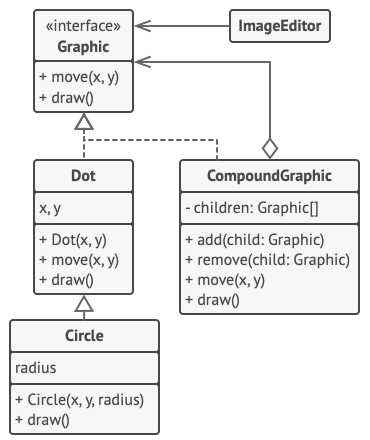

Here is the text formatted into clean, readable Markdown. I have converted the code examples to **Java** to match our previous context, and I have placed the diagrams where they fit best.

---

# The Composite Pattern: The "Box Inside a Box" Strategy

**Definition:** The Composite pattern is a structural design pattern that lets you compose objects into tree structures and then work with these structures as if they were individual objects.

**In Simple English:** It allows you to treat a **Group** of objects the exact same way you treat a **Single** object.

---

## 1. The Problem: The Amazon Delivery Nightmare

Imagine you are building a shipping system for a company like Amazon. You have two fundamental types of items:

- **Product:** A simple item (e.g., a hammer, a phone).
- **Box:** A container that can hold Products... or other Boxes.

If you need to calculate the total price of a massive shipment, you might be tempted to use a loop. However, since boxes can contain other boxes (nested indefinitely), a simple loop fails. You end up writing complex, fragile code like this:

### The Bad Way: "Spaghetti Code" with Type Checks

```java
public double calculatePrice(Object item) {
    double total = 0;

    // We have to manually check what the item is
    if (item instanceof Product) {
        total += ((Product) item).getPrice();
    } else if (item instanceof Box) {
        Box box = (Box) item;
        for (Object innerItem : box.getItems()) {
            // We have to manually trigger recursion
            // And what if we add a "Crate" or "Bag" later? The code breaks!
            total += calculatePrice(innerItem);
        }
    }
    return total;
}

```

**Why this fails:**

1. **It is messy:** You have to check the type of every object (`instanceof`).
2. **It is rigid:** If you add a new container type, you have to rewrite the price calculator.
3. **It violates the Open/Closed Principle.**

---

## 2. The Solution: The Composite Tree

The Composite pattern solves this by using a **Common Interface**. We stop distinguishing between "Boxes" and "Products." Instead, we treat them both as an "Item" (or Component).

- **Leaf (Product):** Knows its price.
- **Composite (Box):** Doesn't know the price of its contents. It simply loops through its children and asks _them_ for their price.

The Box doesn't care if a child is a Product or another Box. It just sends the message: _"Give me your price."_

**Structure of the Pattern:**


---

## 3. Implementation (The Geometric Shapes Example)

Here is how we implement this structure in **Java** using a Graphics editor example. We want to be able to move a single `Dot` or a `Group` of Dots exactly the same way.

**Visualizing the Classes:**


### Step 1: The Component Interface

This declares the common operations for both simple and complex objects.

```java
public interface Graphic {
    void move(int x, int y);
    void draw();
}

```

### Step 2: The Leaf (Simple Object)

This is the basic unit that does the actual work.

```java
public class Dot implements Graphic {
    private int x, y;

    public Dot(int x, int y) {
        this.x = x;
        this.y = y;
    }

    @Override
    public void move(int x, int y) {
        this.x += x;
        this.y += y;
    }

    @Override
    public void draw() {
        System.out.println("Drawing a Dot at " + x + ", " + y);
    }
}

```

### Step 3: The Composite (Container Object)

This contains a list of children. When it receives a command, it delegates it to all children.

```java
import java.util.ArrayList;
import java.util.List;

public class CompoundGraphic implements Graphic {
    private List<Graphic> children = new ArrayList<>();

    public void add(Graphic child) {
        children.add(child);
    }

    public void remove(Graphic child) {
        children.remove(child);
    }

    // The Magic: Move the group by asking each child to move itself
    @Override
    public void move(int x, int y) {
        for (Graphic child : children) {
            child.move(x, y);
        }
    }

    @Override
    public void draw() {
        System.out.println("--- Compound Start ---");
        for (Graphic child : children) {
            child.draw();
        }
        System.out.println("--- Compound End ---");
    }
}

```

### Step 4: Client Code

The client doesn't need to know if it is holding a Dot or a CompoundGraphic.

```java
public class Main {
    public static void main(String[] args) {
        Dot dot1 = new Dot(1, 2);
        Dot dot2 = new Dot(3, 4);

        CompoundGraphic group = new CompoundGraphic();
        group.add(dot1);
        group.add(dot2);

        // We treat the group exactly like a single dot!
        group.draw();

        // Moves all dots inside the group at once
        group.move(10, 10);
    }
}

```

---

## 4. Real-World Analogy: The Army Hierarchy

1. **The General:** Gives the order "Attack!"
2. **The Colonel:** Receives the order and passes it to his Captains.
3. **The Captain:** Passes it to the Lieutenants.
4. **The Soldier (Leaf):** Actually fires the weapon.

The General does not need to know the name of every soldier or how many squads there are. He issues **one command** to the top of the tree, and it ripples down automatically.

---

## 5. When to Use It (Applicability)

- **Tree Structures:** Use this when your data is naturally hierarchical (e.g., File Systems, Menus, Organization Charts).
- **Uniformity:** Use this when you want your client code to treat simple objects and complex compositions of objects uniformly.

---

## 6. Pros and Cons

| Pros                                                                                                              | Cons                                                                                                                                            |
| ----------------------------------------------------------------------------------------------------------------- | ----------------------------------------------------------------------------------------------------------------------------------------------- |
| **Simplicity:** Client code becomes very simple (no loops or type checks).                                        | **Over-Generalization:** It can be hard to create a common interface. For example, a File has a size, but a Folder calculates size differently. |
| **Open/Closed Principle:** You can add new types of Leaves (e.g., Circle, Square) without changing existing code. | **Empty Methods:** You might violate ISP if you force Leaves to implement methods like `addChild` (which they can't do).                        |

---

## 7. Relations with Other Patterns

- **Builder:** You can use the Builder pattern to construct complex Composite trees step-by-step.
- **Chain of Responsibility:** Often used with Composite. A leaf can pass a request up the chain to its parent.
- **Iterator:** Used to traverse the Composite tree without exposing its underlying structure.
- **Decorator:** Similar structure, but a Decorator adds behavior to a _single_ child, while Composite aggregates results from _multiple_ children.
