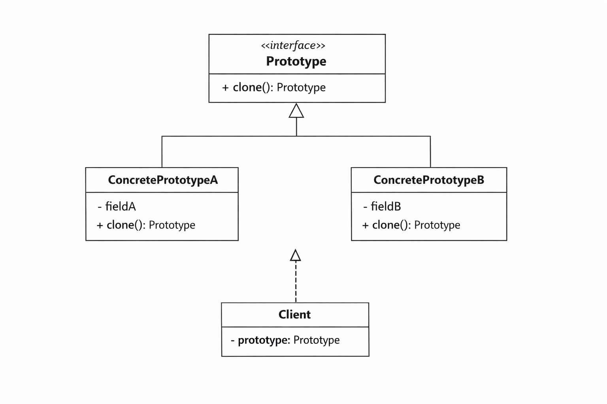

# Patron de conception : Prototype

## Motivation

Parfois, créer un objet from scratch est coûteux — il peut nécessiter des appels réseau, des lectures de base de données, ou des calculs lourds. Si on a déjà un objet configuré, pourquoi ne pas simplement le copier ?

## Problème

Regardons le morceau de code suivant :

```java
// Un objet coûteux à créer
class GameCharacter {
    private String name;
    private int health;
    private int attack;
    private List<String> skills; // liste potentiellement longue à reconstruire

    public GameCharacter(String name, int health, int attack, List<String> skills) {
        this.name = name;
        this.health = health;
        this.attack = attack;
        this.skills = skills;
        // Imaginez ici un appel réseau ou un calcul lourd pour charger les skills
        System.out.println("Création lourde d'un personnage...");
    }
}

class Main {
    public static void main(String args[]) {
        List<String> skills = List.of("Fireball", "Shield", "Dash");

        // On veut créer 10 ennemis similaires
        for (int i = 0; i < 10; i++) {
            GameCharacter enemy = new GameCharacter("Goblin", 100, 15, skills);
            // Chaque création recharge tout depuis zéro — très coûteux
        }
    }
}
```

On crée chaque objet from scratch alors qu'ils sont presque identiques. De plus, si on essaie de copier un objet directement :

```java
GameCharacter copy = original; // ce n'est pas une copie — c'est la même référence
copy.setHealth(50);            // ceci modifie aussi original — comportement inattendu
```

## Principe

Le patron Prototype énonce que **plutôt que de créer un nouvel objet from scratch, on clone un objet existant et on modifie uniquement ce qui doit changer**. L'objet lui-même est responsable de sa propre copie.

Pour mieux visualiser la structure du patron, voir :


## Solution

On définit une interface `Prototype` avec une méthode `clone()`, et chaque classe implémente sa propre logique de copie.

```java
// L'interface Prototype
interface Prototype {
    Prototype clone();
}

// La classe concrète qui sait se cloner
class GameCharacter implements Prototype {
    private String name;
    private int health;
    private int attack;
    private List<String> skills;

    public GameCharacter(String name, int health, int attack, List<String> skills) {
        this.name = name;
        this.health = health;
        this.attack = attack;
        this.skills = new ArrayList<>(skills); // deep copy de la liste
        System.out.println("Création lourde d'un personnage...");
    }

    // Constructeur de copie — utilisé par clone()
    private GameCharacter(GameCharacter other) {
        this.name = other.name;
        this.health = other.health;
        this.attack = other.attack;
        this.skills = new ArrayList<>(other.skills); // deep copy
        // Pas de recalcul lourd ici
    }

    @Override
    public GameCharacter clone() {
        return new GameCharacter(this);
    }

    public void setHealth(int health) { this.health = health; }
    public void setName(String name) { this.name = name; }

    public String toString() {
        return name + " | HP: " + health + " | ATK: " + attack + " | Skills: " + skills;
    }
}

class Main {
    public static void main(String args[]) {
        List<String> skills = List.of("Fireball", "Shield", "Dash");

        // On crée un seul objet de base — création lourde une seule fois
        GameCharacter baseGoblin = new GameCharacter("Goblin", 100, 15, skills);

        // On clone pour créer les variantes — rapide et indépendant
        GameCharacter goblin1 = baseGoblin.clone();
        goblin1.setHealth(80);

        GameCharacter goblin2 = baseGoblin.clone();
        goblin2.setName("Elite Goblin");

        System.out.println(goblin1); // Goblin | HP: 80 ...
        System.out.println(goblin2); // Elite Goblin | HP: 100 ...
        System.out.println(baseGoblin); // inchangé
    }
}
```

Chaque clone est une copie indépendante. Modifier un clone ne touche jamais l'original, et la création lourde n'est faite qu'une seule fois.

## Points importants

**Shallow copy vs Deep copy** : si l'objet contient des références (comme une `List`), il faut faire une deep copy — sinon tous les clones partagent la même liste et se modifient mutuellement.

Java propose aussi `Cloneable` et la méthode `Object.clone()` nativement, mais elle est considérée problématique en pratique. Le constructeur de copie explicite est préférable.
