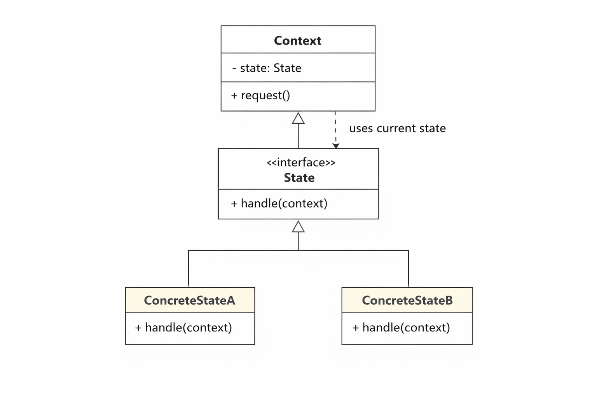

# Patron de conception : State

## Motivation

En OOP, un objet peut changer de comportement selon son état interne. La solution naïve est d'utiliser des `if/else` ou `switch` partout — mais plus les états sont nombreux, plus le code devient difficile à lire, à maintenir, et à étendre.

## Problème

Regardons le morceau de code suivant :

```java
// Un distributeur automatique géré avec des flags
class VendingMachine {
    private String state = "idle"; // "idle", "hasMoney", "dispensing"
    private int stock = 5;

    public void insertMoney() {
        if (state.equals("idle")) {
            System.out.println("Argent inséré.");
            state = "hasMoney";
        } else if (state.equals("hasMoney")) {
            System.out.println("Argent déjà inséré.");
        } else if (state.equals("dispensing")) {
            System.out.println("Veuillez attendre.");
        }
    }

    public void pressButton() {
        if (state.equals("idle")) {
            System.out.println("Insérez de l'argent d'abord.");
        } else if (state.equals("hasMoney")) {
            if (stock > 0) {
                System.out.println("Produit dispensé.");
                stock--;
                state = "idle";
            } else {
                System.out.println("Stock vide.");
                state = "idle";
            }
        } else if (state.equals("dispensing")) {
            System.out.println("Déjà en train de dispenser.");
        }
    }
}
```

Chaque méthode doit connaître tous les états possibles. Si on ajoute un nouvel état `"maintenance"`, il faut modifier chaque méthode — le code explose en complexité. De plus :

```java
// Rien n'empêche d'écrire un état invalide
state = "maientance"; // faute de frappe — aucune erreur à la compilation
```

## Principe

Le patron State énonce que **chaque état doit être encapsulé dans sa propre classe**. L'objet principal délègue son comportement à l'état courant, et chaque état sait lui-même comment réagir aux actions et vers quel état transitionner.

Pour mieux visualiser la structure du patron, voir :


## Solution

On définit une interface `State`, une classe concrète par état, et la machine délègue tout à son état courant.

```java
// L'interface State — le contrat commun à tous les états
interface State {
    void insertMoney(VendingMachine machine);
    void pressButton(VendingMachine machine);
}

// État : en attente
class IdleState implements State {
    public void insertMoney(VendingMachine machine) {
        System.out.println("Argent inséré.");
        machine.setState(new HasMoneyState());
    }
    public void pressButton(VendingMachine machine) {
        System.out.println("Insérez de l'argent d'abord.");
    }
}

// État : argent inséré
class HasMoneyState implements State {
    public void insertMoney(VendingMachine machine) {
        System.out.println("Argent déjà inséré.");
    }
    public void pressButton(VendingMachine machine) {
        if (machine.getStock() > 0) {
            System.out.println("Produit dispensé.");
            machine.decrementStock();
            machine.setState(new IdleState());
        } else {
            System.out.println("Stock vide. Remboursement.");
            machine.setState(new IdleState());
        }
    }
}

// La machine — elle ne connaît plus aucun détail d'état
class VendingMachine {
    private State currentState;
    private int stock;

    public VendingMachine(int stock) {
        this.stock = stock;
        this.currentState = new IdleState();
    }

    public void insertMoney()  { currentState.insertMoney(this); }
    public void pressButton()  { currentState.pressButton(this); }

    public void setState(State state) { this.currentState = state; }
    public int getStock()             { return stock; }
    public void decrementStock()      { stock--; }
}

class Main {
    public static void main(String args[]) {
        VendingMachine machine = new VendingMachine(2);

        machine.insertMoney();  // Argent inséré.
        machine.pressButton();  // Produit dispensé.

        machine.pressButton();  // Insérez de l'argent d'abord.

        machine.insertMoney();  // Argent inséré.
        machine.insertMoney();  // Argent déjà inséré.
        machine.pressButton();  // Produit dispensé.

        machine.insertMoney();  // Argent inséré.
        machine.pressButton();  // Stock vide. Remboursement.
    }
}
```

Ajouter un nouvel état `MaintenanceState` ne nécessite plus de toucher aux états existants — on crée simplement une nouvelle classe qui implémente `State`.

## Points importants

**Qui décide de la transition ?** Dans cet exemple, c'est l'état lui-même qui appelle `machine.setState(...)`. On peut aussi centraliser les transitions dans la machine — le choix dépend de la complexité du système.

**State vs Strategy** : les deux patrons ont une structure similaire, mais leur intention est différente. Strategy encapsule un algorithme interchangeable choisi par le client. State encapsule un comportement qui change automatiquement selon l'état interne de l'objet.
